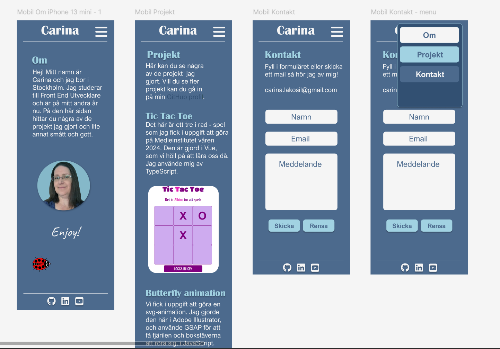
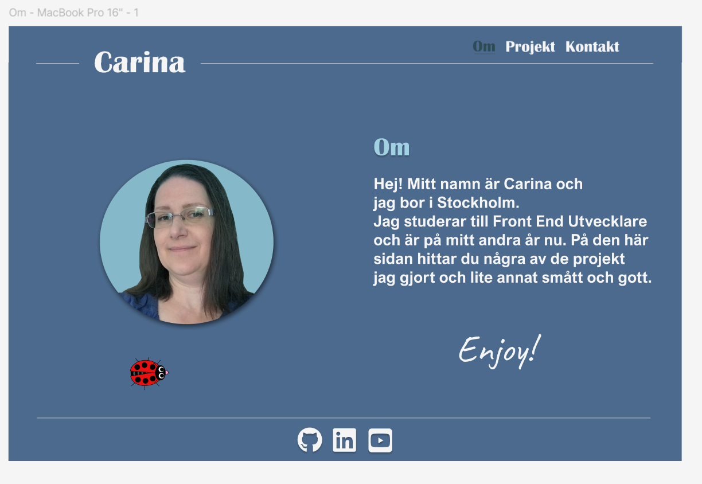
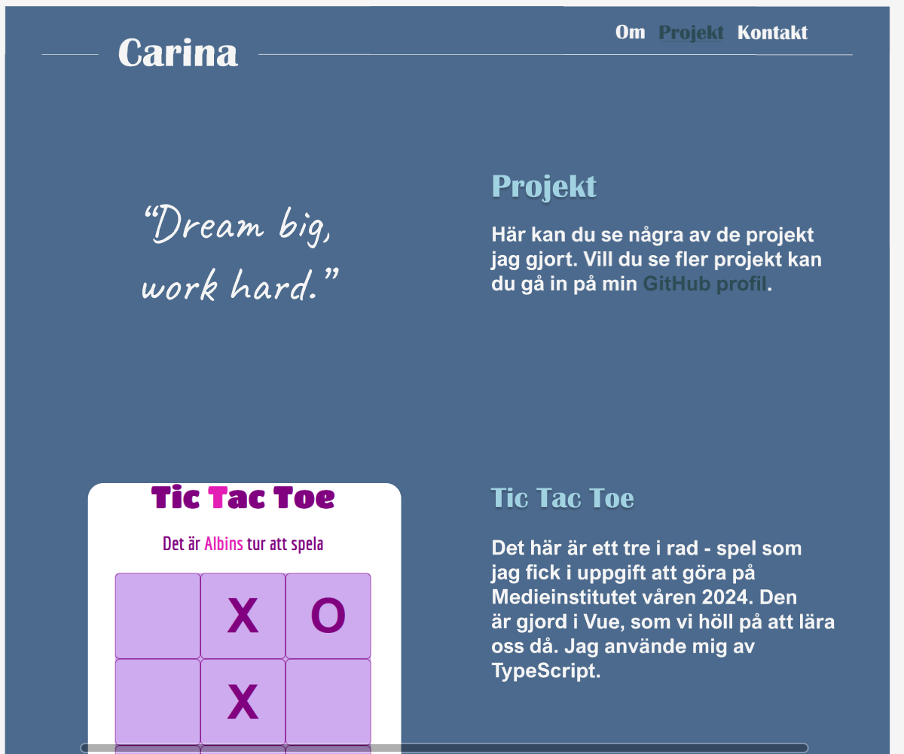
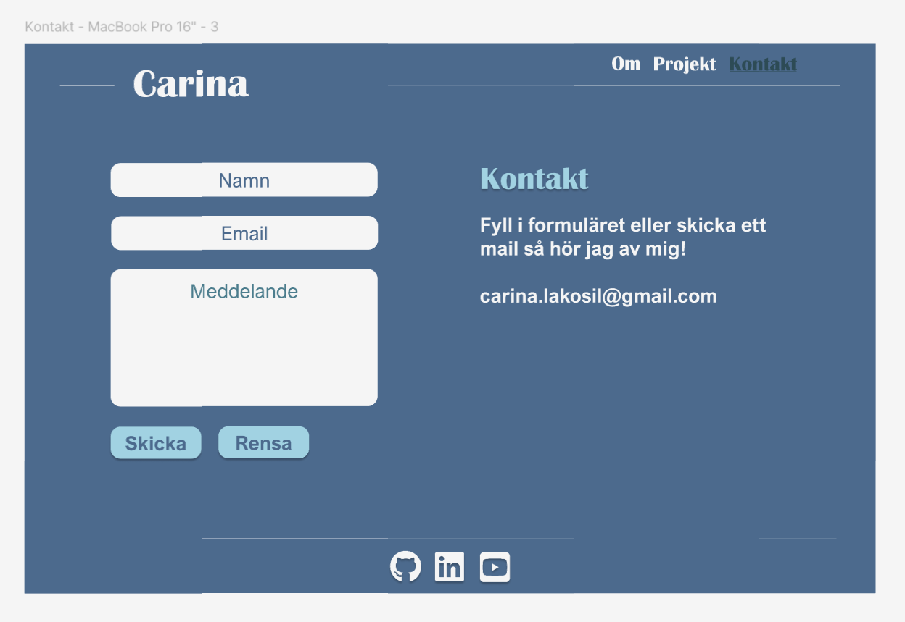

# Carinas Portfolio

## Detta projekt är gjort med Vue, Vite och TypeScript. Animationer är gjorda med hjälp av GSAP.
För att köra projektet skriv i Terminalen:
- npm i (första gången)
- npm run dev (varje gång)

## Planen i Figma hur sidan ska se ut

### Mobila versionen

### Tablet versionen

### ------------------------------------------------------------------------------

Sidan är under konstruktion fortfarande. Planer finns på att:

- Lägga till ett API och ett formulär.
- Ordna med tillgängligheten bättre.
- Se över Reloading när sidan varit öppnad för länge.
- Göra en Desktop-version.
- Uppdatera dokumentationen och lägga till en loggbok för hur sidan "växte fram". (Loggbok finns men måste renskrivas och läggas in).

